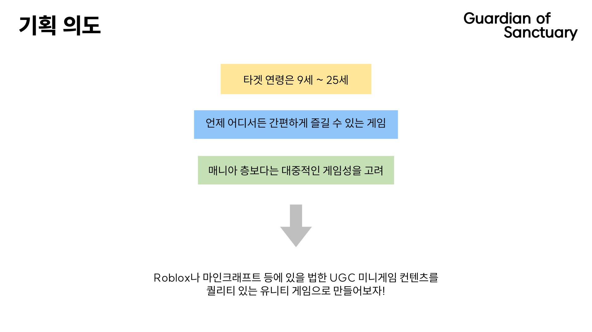
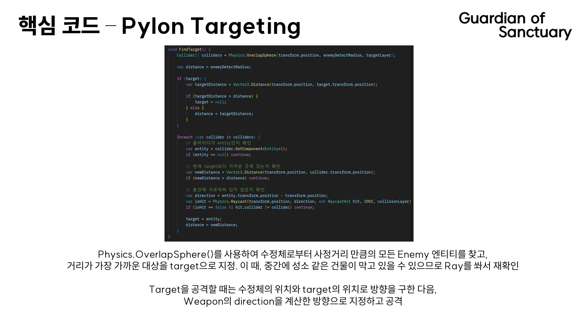

## Guardian of Sanctuary

VR/AR/게임제작기초 수업의 기말 프로젝트로 제출한 게임, "Guardian of Sanctuary"입니다.

-   제작 기간: 2023년 11월 26일 ~ 12월 8일
-   장르: 1인칭 3D FPS 디펜스 게임
-   플랫폼: iOS
-   테스트 환경: iPhone 13, iOS 16.1

## 시연 동영상

#### [유튜브 영상 보러가기](https://youtu.be/p3EBhVLYf4M)

## 프로젝트 소개

## 피그마 디자인

## 기타

-   본 레포지토리는 외부 애셋을 제외하고 업로드하였습니다. 빌드가 불가능할 수 있습니다.
